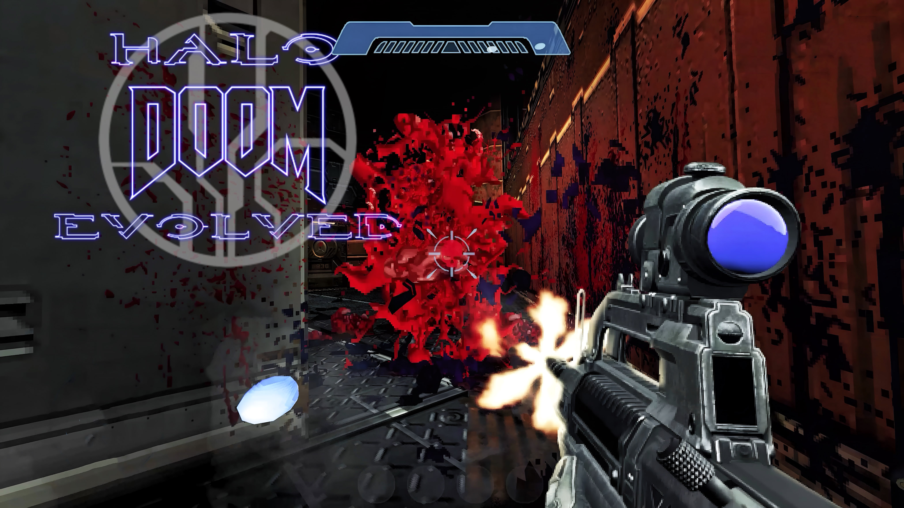
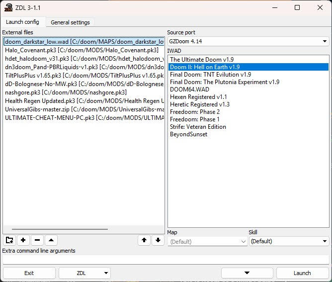
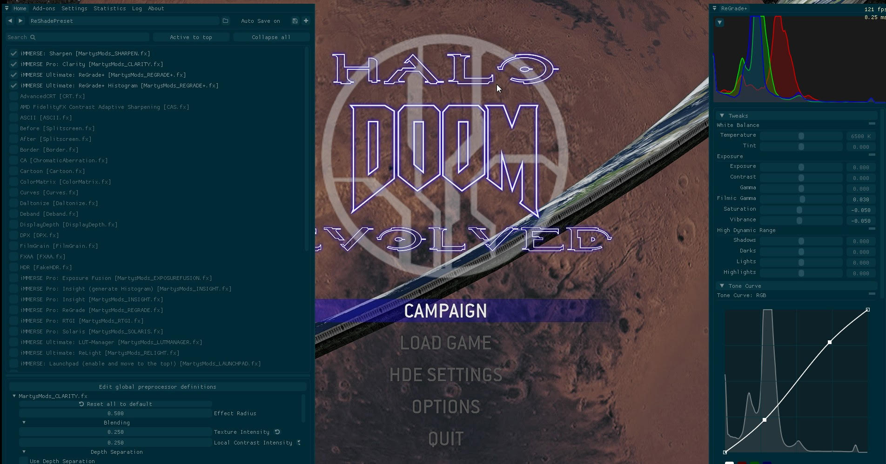

# Halo: Doom Evolved

How to set up `Halo: Doom Evolved` with the `GZDoom`.

## GZDoom

Download the latest version of GZDoom:

[https://github.com/ZDoom/gzdoom](https://github.com/ZDoom/gzdoom)

## Halo Doom Mod

Download Halo: Doom Evolved for GZDoom:

[https://www.moddb.com/mods/halo-doom-evolved](https://www.moddb.com/mods/halo-doom-evolved)

[Mirror](https://1024terabox.com/s/1Vj-VvbXYuyz-5hmJrwiY5A)

Place the mod in your doom mods folder

## Covenant Monsters Mod

Download Covenant Monsters Mod:

[https://www.mediafire.com/file/94gbusp2zwhqkoq/Halo_Covenant.pk3/file](https://www.mediafire.com/file/94gbusp2zwhqkoq/Halo_Covenant.pk3/file)

[Mirror](https://1024terabox.com/s/1Vj-VvbXYuyz-5hmJrwiY5A)

## Dark Star Map

Download Dark Star Map:

[https://www.mediafire.com/file/pdm73fa99mbcc29/doom_darkstar_low.zip](https://www.mediafire.com/file/pdm73fa99mbcc29/doom_darkstar_low.zip)

[Mirror](https://1024terabox.com/s/1Vj-VvbXYuyz-5hmJrwiY5A)

Place the map in your doom maps folder

## Download Doom Mod Launcher

Download the ZDL launcher for GZDoom:

[https://github.com/lcferrum/qzdl](https://github.com/lcferrum/qzdl)

Add GZDoom to the launcher, point it to your Doom 2 .wad file and load mods in this order:

## Download ReShade to enhance the look of Doom

Download ReShade for Windows:

[https://reshade.me/](https://reshade.me/)

Install reshade to GZDoom using OpenGL

## Example Gameplay

<iframe width="100%" style={{"aspect-ratio": "16 / 9"}} src="https://www.youtube.com/embed/AVuxDrzlsN8" title="Populous: The Beginning" frameborder="0" allow="accelerometer; autoplay; clipboard-write; encrypted-media; gyroscope; picture-in-picture; web-share" referrerpolicy="strict-origin-when-cross-origin" allowfullscreen></iframe>