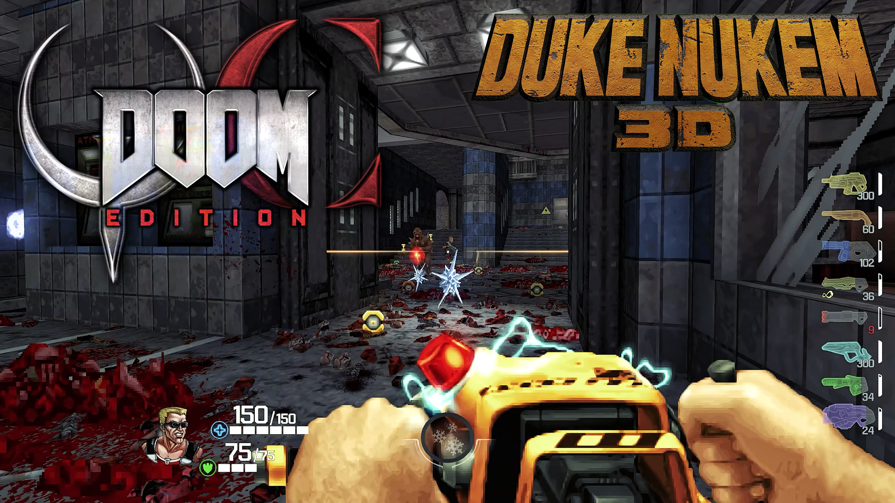

# QCDE 2.7: Duke Nukem

How to set up `QCDE 2.7` with `GZDoom`.

## GZDoom

Download the latest version of GZDoom:

[https://github.com/ZDoom/gzdoom](https://github.com/ZDoom/gzdoom)

## QCDE Doom Mod

Download QCDE 2.7 for GZDoom:

[https://www.moddb.com/mods/quake-champions-doom-edition](https://www.moddb.com/mods/quake-champions-doom-edition)

[Mirror](https://1024terabox.com/s/1Vj-VvbXYuyz-5hmJrwiY5A)

Place the mod in your doom mods folder. QCDE 2.7 is the final version that works with GZDoom, newer versions require Zandronum

## Demon CounterStrike Mod

Download Demon CounterStrike Mod:

[https://zandronum.com/forum/viewtopic.php?t=9043](https://zandronum.com/forum/viewtopic.php?t=9043)

[Mirror](https://1024terabox.com/s/1Vj-VvbXYuyz-5hmJrwiY5A)

Demon CounterStrike spawns in endless waves of enemies every few seconds with increasing intensity

## QCDE Deathmatch Map

Download QCDE Deathmatch map:

[https://www.moddb.com/mods/quake-champions-doom-edition/downloads/qcde-maps-deathmatch-mapset](https://www.moddb.com/mods/quake-champions-doom-edition/downloads/qcde-maps-deathmatch-mapset)

[Mirror](https://1024terabox.com/s/1Vj-VvbXYuyz-5hmJrwiY5A)

Place the map in your doom maps folder

## Download Doom Mod Launcher

Download the ZDL launcher for GZDoom:

[https://github.com/lcferrum/qzdl](https://github.com/lcferrum/qzdl)

Add GZDoom to the launcher, point it to your Doom 2 .wad file and load mods and map

## Example Gameplay

<iframe width="100%" style={{"aspect-ratio": "16 / 9"}} src="https://www.youtube.com/embed/F9NNne5sTVk" title="QCDE 2.7: Duke Nukem" frameborder="0" allow="accelerometer; autoplay; clipboard-write; encrypted-media; gyroscope; picture-in-picture; web-share" referrerpolicy="strict-origin-when-cross-origin" allowfullscreen></iframe>