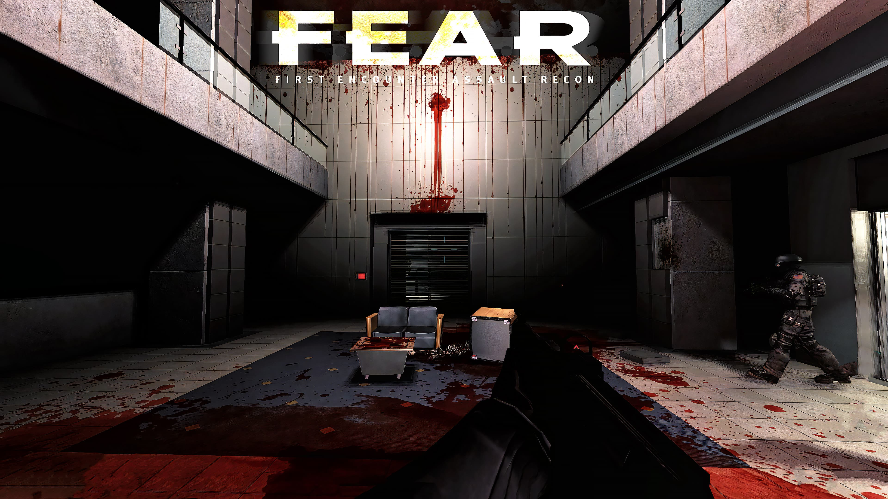

# F.E.A.R: EchoPatch

How to set up `EchoPatch` for `F.E.A.R`.

## F.E.A.R

Download & install **F.E.A.R** from Steam or GOG:

[F.E.A.R Steam](https://store.steampowered.com/app/21090/FEAR/)

[F.E.A.R GOG](https://www.gog.com/en/game/fear_platinum)

## EchoPatch

**EchoPatch** Modernizes F.E.A.R. and its expansions with HUD scaling and a variety of enhancements.

Visit the GitHub repo and download the latest release.

[EchoPatch Download](https://github.com/Wemino/EchoPatch)

Extract the contents of the zip file into the game’s folder, in the same directory as the `FEAR.exe` file

## Soft Shadows

For soft shadows to work in F.E.A.R properly, disable *FXAA* & *VSync* in the game's settings menu.

## Vulkan Wrapper (Optional)

**DXVK** Makes the game run with Vulkan API instead of DirectX 9, providing better performance and compatibility with other enhancements.

Visit the GitHub repo and download the latest release.

[DXVK Download](https://github.com/doitsujin/dxvk)

Extract the contents of `dxvk-2.5.3.tar.gz`, then open the `x86` folder, drag & drop `dxd9.dll` in to the game's folder.

## ReShade (Optional)

**ReShade** Can be used to enhance the game's textures, lighting and colour.

[ReShade Download](https://reshade.me)

Follow instructions on ReShade's website to install it in F.E.A.R. If you added the DXVK Vulkan wrapper, install it using Vulkan, otherwise use DirectX 9.

## Example Gameplay

<iframe width="100%" style={{"aspect-ratio": "16 / 9"}} src="https://www.youtube.com/embed/krmG3fNDC8k" title="F.E.A.R: EchoPatch" frameborder="0" allow="accelerometer; autoplay; clipboard-write; encrypted-media; gyroscope; picture-in-picture; web-share" referrerpolicy="strict-origin-when-cross-origin" allowfullscreen></iframe>