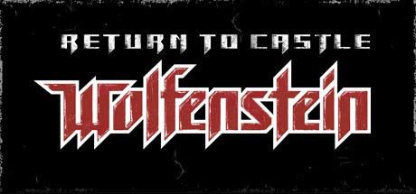
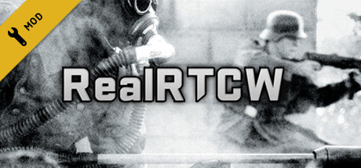

# RealRTCW

How to set up `RealRTCW` for `Return to Castle Wolfenstein`.

## Return to Castle Wolfenstein

Download & install **Return to Castle Wolfenstein** for Windows:

[Steam](https://store.steampowered.com/app/9010/Return_to_Castle_Wolfenstein/)

[GOG](https://www.gog.com/en/game/return_to_castle_wolfenstein)

## RealRTCW Mod

**RealRTCW** is an overhaul mod for critically acclaimed Wolfenstein classic. It features improved visuals, expanded arsenal, rebalanced gunplay and proper modern systems support!

If you downloaded the Steam version of Return to Castle Wolfenstein, download RealRTCW from Steam, or grab it from ModDB if you downloaded the GOG version of RTCW:

[Steam](https://store.steampowered.com/app/1379630/RealRTCW/)

[ModDB](https://www.moddb.com/mods/realrtcw-realism-mod)

For the Steam version, simply launch RealRTCW from your library to play. For the ModDB version, follow instructions of the installer you just downloaded then launch from the new shortcut in Start bar or your Desktop.

## Example Gameplay

<iframe width="100%" style={{"aspect-ratio": "16 / 9"}} src="https://www.youtube.com/embed/y79XKo9lRVs" title="Populous: The Beginning" frameborder="0" allow="accelerometer; autoplay; clipboard-write; encrypted-media; gyroscope; picture-in-picture; web-share" referrerpolicy="strict-origin-when-cross-origin" allowfullscreen></iframe>