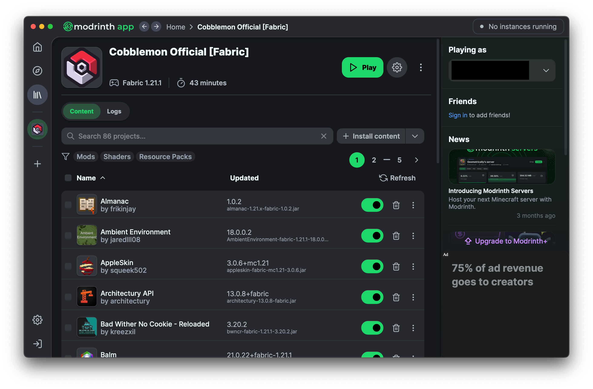

# Cobblemon Mod

How to set up `Cobblemon 1.6.1` for `Minecraft 1.21.1`.

## Modrinth Launcher

Download the **Modrinth App** for your system:

[https://modrinth.com/app](https://modrinth.com/app)

Install & open the launcher, then sign in to your Minecraft account.

## Cobblemon Mod Pack

Grab the official `Cobblemon` mod pack for `Fabric`:

[https://modrinth.com/modpack/cobblemon-fabric](https://modrinth.com/modpack/cobblemon-fabric)

Click **Download** and then choose ***Install with Modrinth App***

The app will download all required mods and create a specialized instance of Minecraft 1.21.1 with Fabric API.

Modrinth will download and install [Azul Java](https://www.azul.com/downloads/), a performant version of OpenJDK for Minecraft.

## Launch Cobblemon

Start Cobblemon by selecting the instance in the ***Modrinth App*** and clicking the **Play** button.

Minecraft will launch, Cobblemon includes a tutorial world to get started. This version of Cobblemon is compatible with all Cobblemon servers.

## Example Gameplay

<iframe width="100%" style={{"aspect-ratio": "16 / 9"}} src="https://www.youtube.com/embed/FA-3t3zVkeY" title="Minecraft Cobblemon" frameborder="0" allow="accelerometer; autoplay; clipboard-write; encrypted-media; gyroscope; picture-in-picture; web-share" referrerpolicy="strict-origin-when-cross-origin" allowfullscreen></iframe>

## Make your own Cobblemon Server

Want to set up your own **Cobblemon server** that's compatible with this mod? Take a look at **[Cobblemon Server Setup](../minecraft/cobblemon-server.md)**