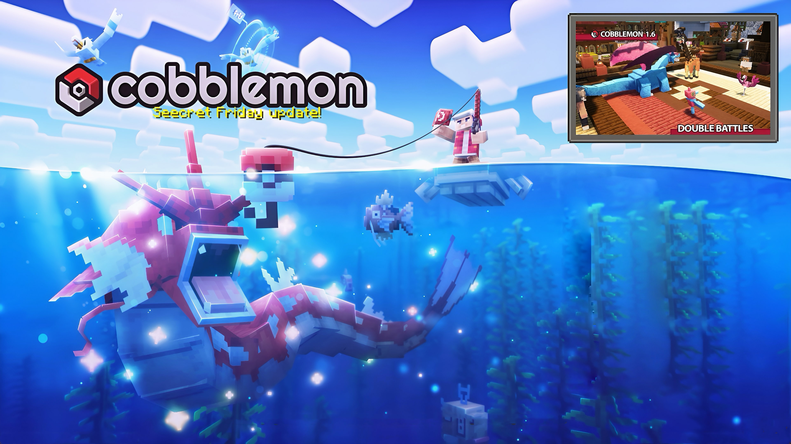
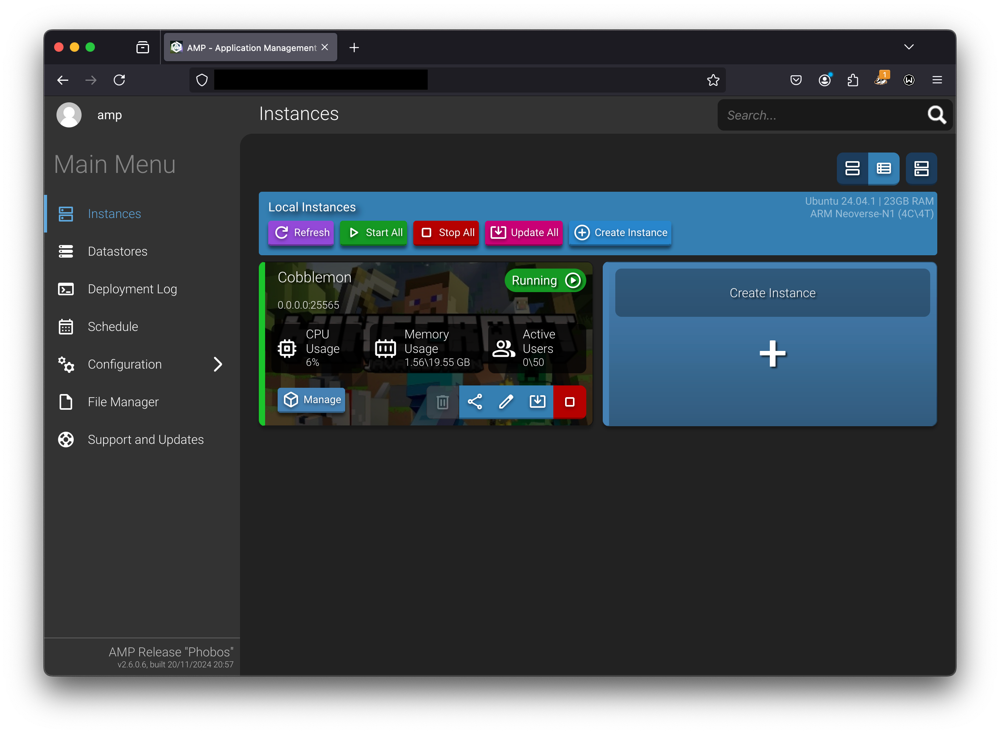
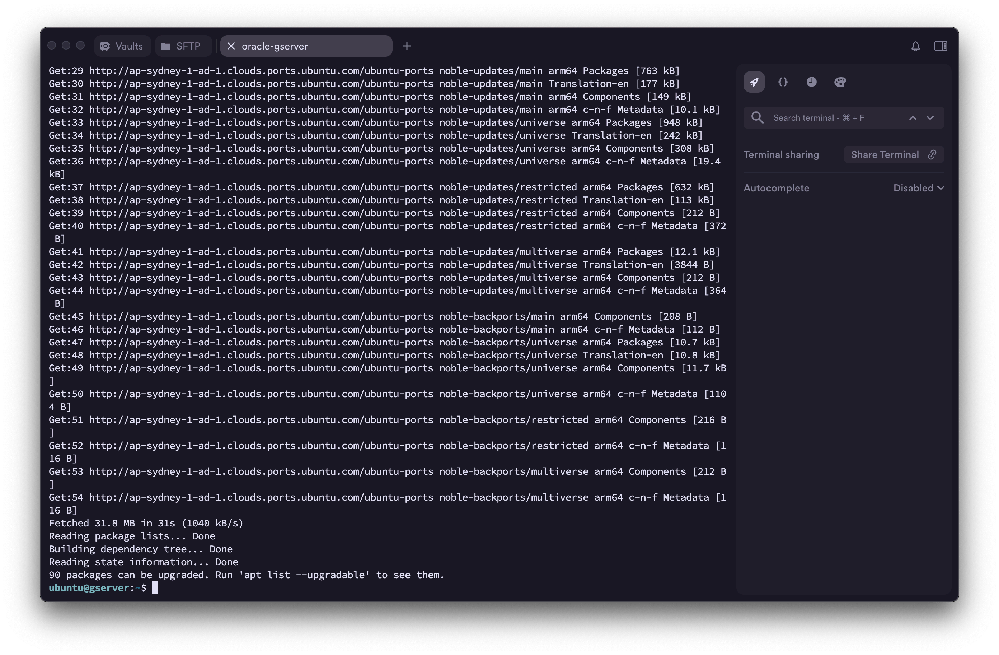
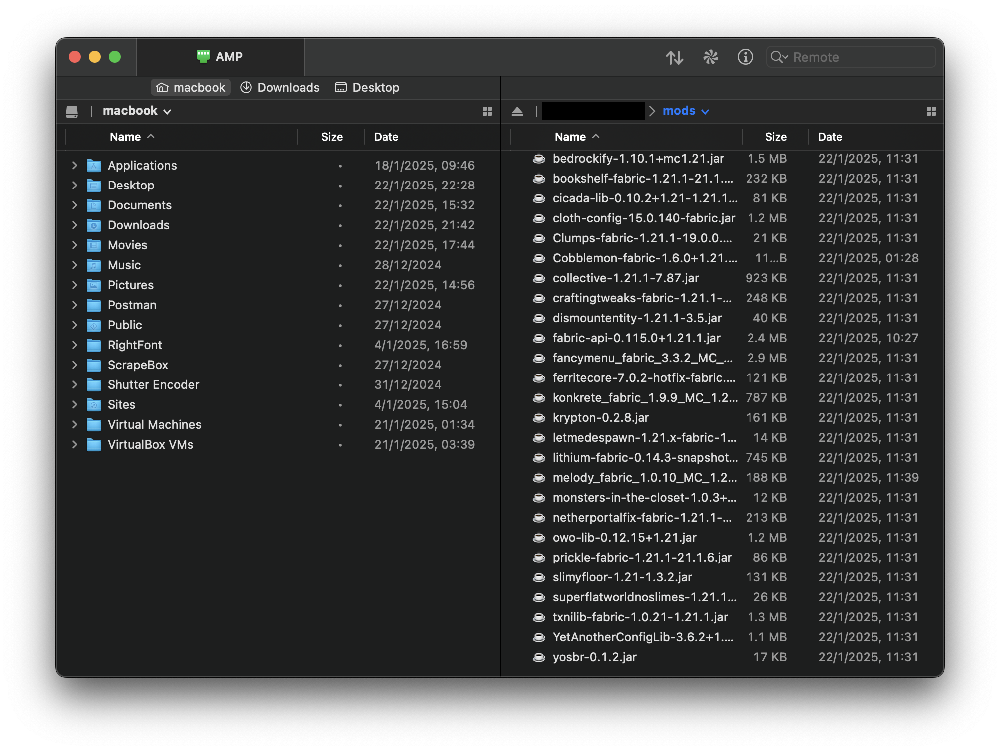

# Cobblemon Server Setup

The following instructions will show you how to set up an always free cloud instance that's fast enough to run a `Minecraft 1.21.1` `Cobblemon 1.6` server.

## Create a free cloud instance

Follow [this guide](https://blogs.oracle.com/developers/post/how-to-set-up-and-run-a-really-powerful-free-minecraft-server-in-the-cloud) to set up a free Oracle Cloud server instance. The free tier can have up to 4-cores, 24gb ram & 200gb storage. Choose a region that's close to you for low ping.

## Download AMP

Grab a copy of CuberCoders AMP game server admin panel for your cloud server from [here](https://cubecoders.com/AMP). Replace the steps in the above guide to install Minecraft with installing AMP instead.

## Install AMP on your server

Download your SSH keys during instance setup. Use an app like [Termius](https://termius.com) for easy SSH management, and use it to install CubeCoders AMP on your server. Follow AMP install instructions in Termius console.

## Open ports on your server

Visit the Oracle instance security page and add rules to open ports 2224 (TCP), 8080 (TCP), 8081 (TCP) and 25565 (TCP & UDP).

## Log in to AMP and setup Minecraft

Visit your server's IPv4 address in your browser with :8080 on the end of the address to open AMP's console. Create a new game server instance and select Minecraft Java Edition. In Minecraft's configuration (Configuration -> Minecraft -> Server and Startup), choose Fabric version 1.21.1, Loader version 0.16.10 and installer version 1.0.1. 

In Java and Memory tab, set memory limit to 20024MB.

## Download Server Mods

Download server-side mods from Modrinth to your pc ready to transform your instance in to a Cobblemon server. When clicking the **Download** button on Modrinth, select ***Game version 1.21.1*** and ***Platform Fabric***.

[Almanac](https://modrinth.com/mod/almanac)
[AppleSkin](https://modrinth.com/mod/appleskin)
[Architectury API](https://modrinth.com/mod/architectury-api)
[Balm](https://modrinth.com/mod/balm)
[Bookshelf](https://modrinth.com/mod/bookshelf-lib)
[CICADA](https://modrinth.com/mod/cicada)
[Cloth Config API](https://modrinth.com/mod/cloth-config)
[Clumps](https://modrinth.com/mod/clumps)
[Cobblemon](https://modrinth.com/mod/cobblemon)
[Collective](https://modrinth.com/mod/collective)
[Crafting Tweaks](https://modrinth.com/mod/crafting-tweaks)
[Dismount Entity](https://modrinth.com/mod/dismount-entity)
[Fabric API](https://modrinth.com/mod/fabric-api)
[FancyMenu](https://modrinth.com/mod/fancymenu)
[FerriteCore](https://modrinth.com/mod/ferrite-core)
[Konkrete](https://modrinth.com/mod/konkrete)
[Krypton](https://modrinth.com/mod/krypton)
[Let Me Despawn](https://modrinth.com/mod/lmd)
[Lithium](https://modrinth.com/mod/lithium)
[Melody](https://modrinth.com/mod/melody)
[Monsters in the Closet](https://modrinth.com/mod/monsters-in-the-closet)
[NetherPortalFix](https://modrinth.com/mod/netherportalfix)
[owo-lib](https://modrinth.com/mod/owo-lib)
[Prickle](https://modrinth.com/mod/prickle)
[SlimyFloor](https://www.curseforge.com/minecraft/mc-mods/slimyfloor)
[Superflat World No Slimes](https://modrinth.com/mod/superflat-world-no-slimes)
[TxniLib](https://modrinth.com/mod/txnilib)
[YetAnotherConfigLib](https://modrinth.com/mod/yacl)
[Your Options Shall Be Respected](https://modrinth.com/mod/yosbr)

## Upload Server Mods

Use an SFTP client like [WinSCP](https://winscp.net/eng/download.php) or [Cyberduck](https://cyberduck.io) to upload the mods to the **mod** folder of your Minecraft server. AMP provides instructions on how to connect.

Restart your server after uploads have completed.

## Connect to your server

Using a [Cobblemon Modded](../minecraft/cobblemon-mod.md) version of Minecraft, connect to your cloud server's IP address in the ***Multiplayer*** window.