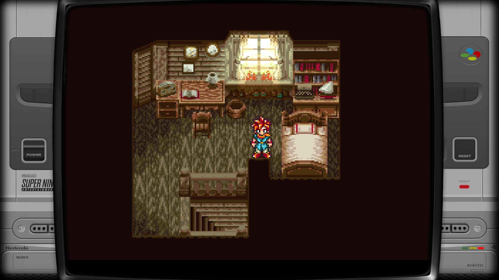

# Chrono Trigger with MSU-1

How to set up `Chrono Trigger` with `MSU-1 Soundtrack`

## Chrono Trigger

Download The original USA version of Chrono Trigger SNES ROM

## MSU-1 Patch

The ROM needs to be patched to enable MSU-1 sound.

Download the MSU-1 patch from here:
[Chrono Trigger MSU-1 Patch](https://www.mediafire.com/file/l5dq6hsynnuf0ox/CT_MSU-1_Patch.zip/file)

Patch the ROM with the downloaded .bps file here:
[BPS Patcher](https://www.smwcentral.net/?p=onlinetools&tool=bps)

## MSU-1 Soundtrack

A soundtrack needs to be placed alongside the rom file in the same folder, with music in .pcm format.

[MSU-1 Soundtrack by Blake Robinson](https://mega.nz/#!mHpyDQwS!B2AsH0Zr-lGcTBJBTXqxYTepertNGGWMl0ch0bMpL98)

While the soundtrack has been provided in the correct format to use in game, you can support the author by purchasing the licensed music from here:
[The Chrono Symphony](http://www.thechronosymphony.com/)

## Compatible Emulator

The BSNES core in Retroarch is capable of playing MSU-1 roms. Ensure the rom file and .pcm files have matching names so they are detected. Ensure you own a copy of Chrono Trigger before playing and enable error detection in core settings.

[Retroarch](https://www.retroarch.com/)

## Example Gameplay

<iframe width="100%" style={{"aspect-ratio": "16 / 9"}} src="https://www.youtube.com/embed/kDRpukD2Y9M" title="Chrono Trigger with MSU-1 Soundtrack" frameborder="0" allow="accelerometer; autoplay; clipboard-write; encrypted-media; gyroscope; picture-in-picture; web-share" referrerpolicy="strict-origin-when-cross-origin" allowfullscreen></iframe>