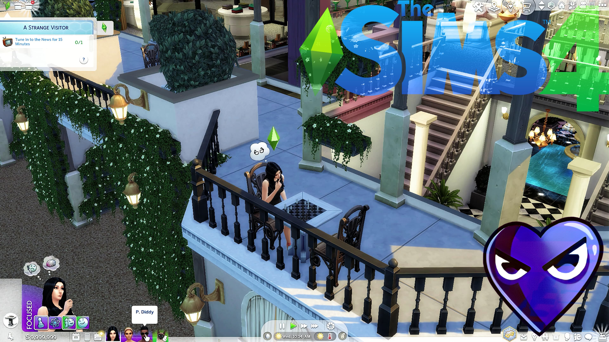
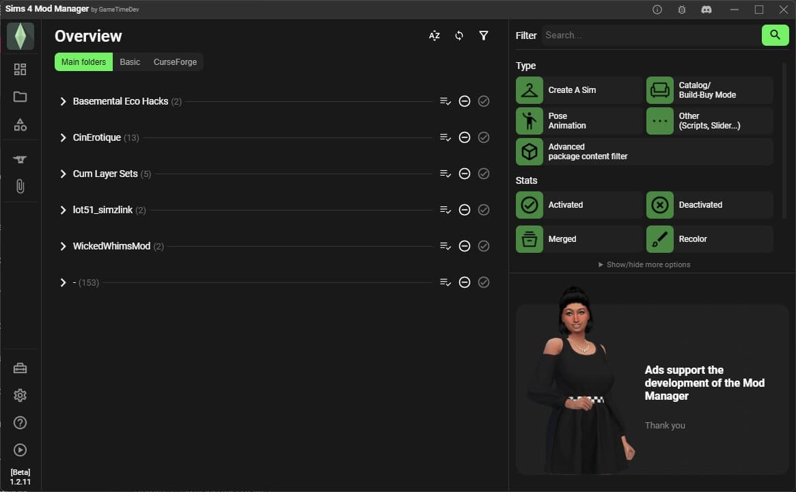
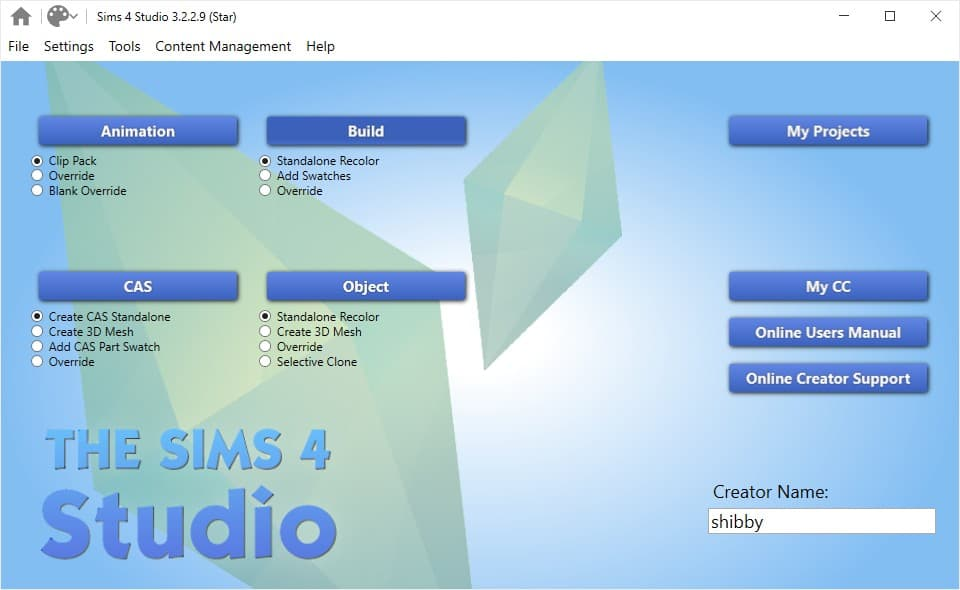
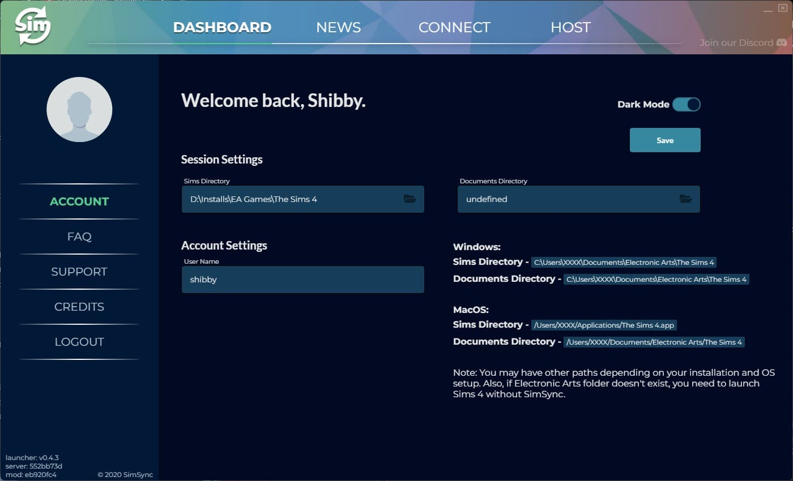

# The Sims 4: Wicked Whims

How to set up `The Sims 4` with `Wicked Whims` and other mods.

## The Sims 4

Download The Sims 4 for Windows:

[Steam](https://store.steampowered.com/app/1222670/The_Sims_4/)

## Wicked Whims

WickedWhims is a mod for The Sims 4 that offers sexual and nudity interactivity, enhanced relationships with extended personalities and attractiveness, playable adult careers, and many more gameplay additions.

Download Wicked Whims from here:
[https://wickedwhimsmod.com/](https://wickedwhimsmod.com/)

## Wicked Whims Mods

Wicked Whims can be expanded with extra mods.

[https://wicked.cc/](https://wicked.cc/)

## Lot51 Mods

Lot51 Mods add a variety of new elements to The Sims 4.

[https://lot51.cc/mods](https://lot51.cc/mods)

## Basemental Drugs

A collection of functional drugs for The Sims 4. The mod features custom drugs, custom animations, altered walk styles, altered moods, altered needs, come-ups, peaks, comedowns, hangovers, addiction, rehabilitation, and loads more.

[BasementalCC](https://basementalcc.com/)

## Sims 4 Mod Manager

The Sims 4 Mod Manager makes managing mods for your game much easier.

[Sims 4 Mod Manager](https://gametimedev.de/S4MM/)

## Sims 4 Studio

The Sims 4 Studio allows you to create custom content for the game.

[Sims 4 Studio](https://sims4studio.com/)

## SimSync

SimSync allows you to play The Sims 4 online with friends.

[SimSync](https://simsync.io/)

## Example Gameplay

<iframe width="100%" style={{"aspect-ratio": "16 / 9"}} src="https://www.youtube.com/embed/2uwYz7sJir0" title="The Sims 4" frameborder="0" allow="accelerometer; autoplay; clipboard-write; encrypted-media; gyroscope; picture-in-picture; web-share" referrerpolicy="strict-origin-when-cross-origin" allowfullscreen></iframe>