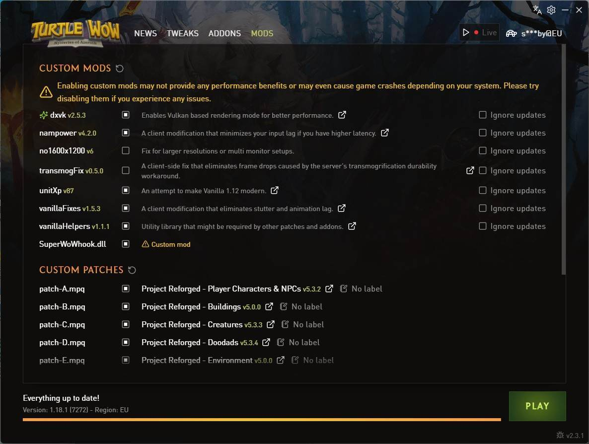
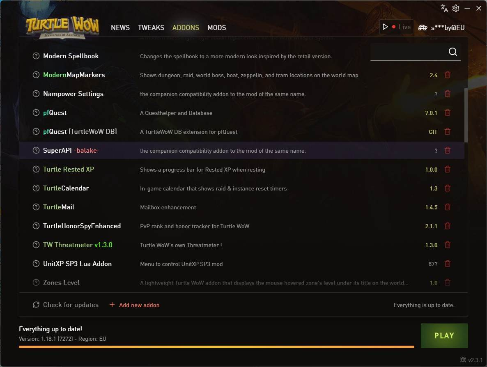
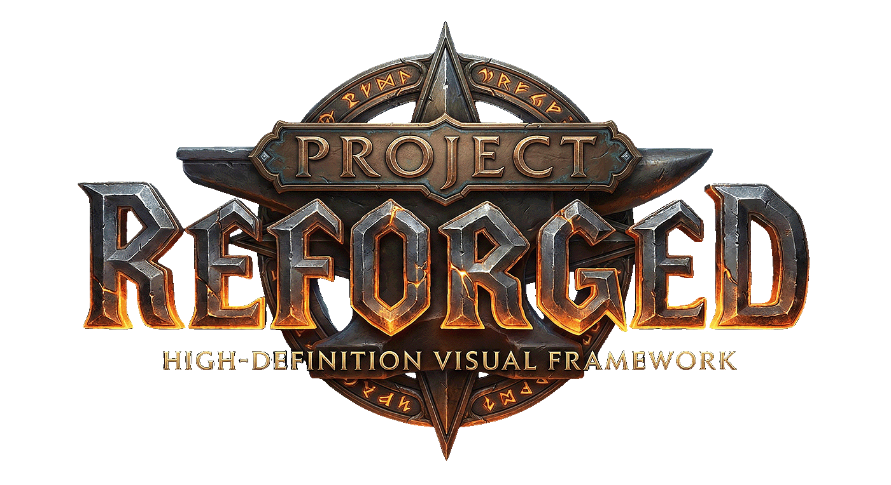
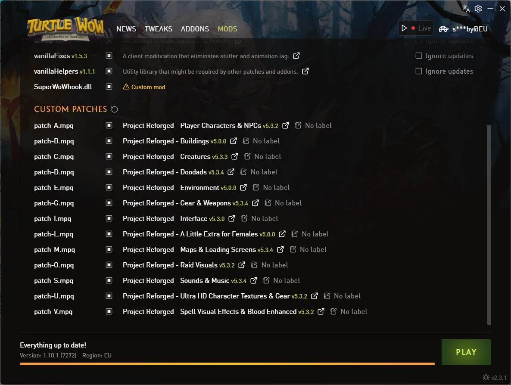

# Turtle WoW with Project Reforged

How to set up `Turtle WoW` with `Project Reforged`

## Turtle Wow

Download and install Turtle WoW from [TurtleCraft](https://turtlecraft.gg/)

## SuperWoW

For a lot of mods and addons to work properly, SuperWoW should be added to Turtle WoW.

**SuperWoW**

Download SuperWoW.release.zip from
 [SuperWoW's GitHub](https://github.com/balakethelock/SuperWoW/releases/tag/Release)

 Open the .zip file and extract SuperWoWhook.dll to Turtle WoW's root directory.

**SuperAPI**

On [SuperAPI's Github](https://github.com/balakethelock/SuperAPI) page, click the **Code button** and select ***Download ZIP***

**Installation**

Open the .zip file and drag the SuperAPI-master folder to the ~/Interface/AddOns folder inside Turtle WoW's directory.

Open the Turtle WoW launcher and apply these mods:

In the Addons tab, enable SuperAPI: 

## Project Reforged

Project Reforged is a HD texture pack mod for classic World of Warcraft.

Download all the mods from [Project Reforged](https://projectreforged.github.io/). You should have patches A, B, C, D, E, G, I, L, M, O, S, U and V.

Move these files to the ~/Data folder inside Turtle WoW's directory.

Open the Turtle WoW launcher and enable the Project Reforged custom patches:

## Reshade

If you'd like to use [ReShade](https://reshade.me/) with Turtle WoW, ensure to only use the standard version as the addon version of ReShade can interfere with networking. Use the Vulkan API since the game uses the DXVK wrapper.

## Example Gameplay

<iframe width="100%" style={{"aspect-ratio": "16 / 9"}} src="https://www.youtube.com/watch?v=06_QJiCYdKY" title="CTurtle WoW: Vanilla World of Warcraft with Project Reforged HD Mod" frameborder="0" allow="accelerometer; autoplay; clipboard-write; encrypted-media; gyroscope; picture-in-picture; web-share" referrerpolicy="strict-origin-when-cross-origin" allowfullscreen></iframe>