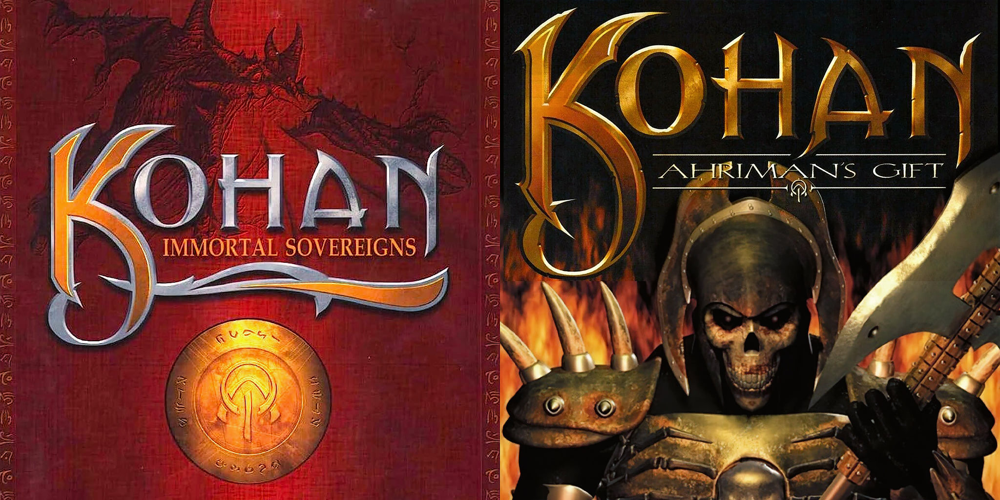
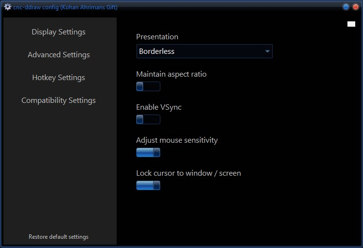

# Kohan: Ahriman's Gift

How to fix low resolution and input lag in `Kohan: Ahriman's Gift` & `Kohan: Immortal Sovereigns`.

## Kohan on Steam

Download Kohan from Steam:

[Kohan: Immortal Sovereigns](https://store.steampowered.com/app/97110/Kohan_Immortal_Sovereigns/)

[Kohan: Ahriman's Gift](https://store.steampowered.com/app/97120/Kohan_Ahrimans_Gift/)

## CNC DDraw

CNC-ddraw can fix compatibility issues in older 2D games, such as black screen, bad performance, crashes or defective Alt+Tab. It does also add new features such as borderless mode, windowed mode and upscaling via shaders.

Download CNC-ddraw from github:
[CNC-ddraw](https://github.com/FunkyFr3sh/cnc-ddraw/releases/latest/download/cnc-ddraw.zip)

## Apply CNC DDraw to Kohan

Right click on Kohan in Steam and select ***Browse Files***.

Extract `cnc-ddraw.zip` to the game's directory, then launch `cnc-ddraw config.exe` and configure to your liking.

Selecting ***Borderless*** and leaving ***Maintain Aspect Ratio*** unchecked will allow Kohan to run in widescreen mode.

## Example Gameplay

<iframe width="100%" style={{"aspect-ratio": "16 / 9"}} src="https://www.youtube.com/embed/JYh0aOJR4O8" title="Populous: The Beginning" frameborder="0" allow="accelerometer; autoplay; clipboard-write; encrypted-media; gyroscope; picture-in-picture; web-share" referrerpolicy="strict-origin-when-cross-origin" allowfullscreen></iframe>