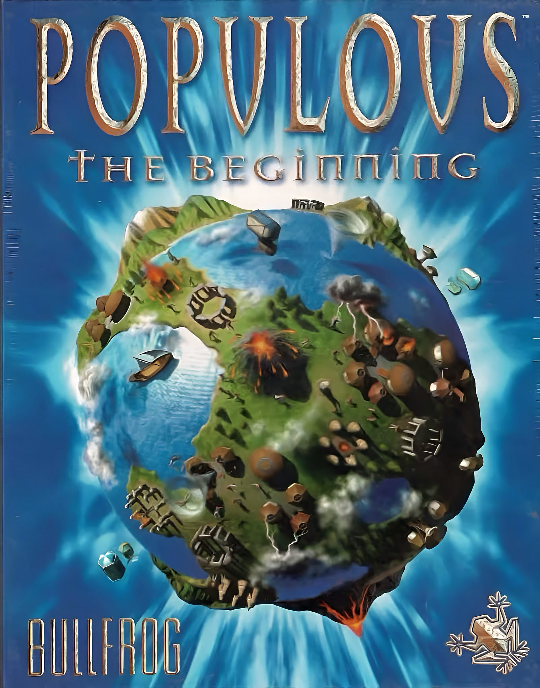
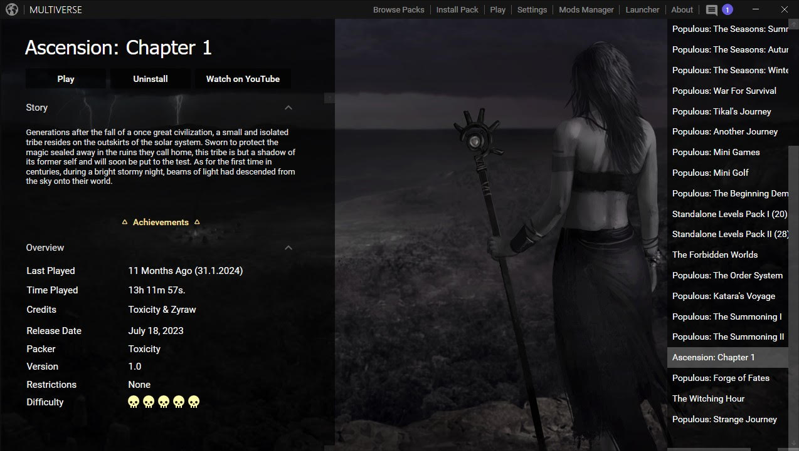

# Populous: The Beginning

How to set up `Populous: The Beginning` with the `Multiverse Launcher`.

## Populous 3

Download Populous: The Beginning for Windows:

[https://thebeginning.uk/play/](https://thebeginning.uk/play/)

[Mirror](https://1024terabox.com/s/1NOrYZYAhSnkONGGUqm8NZQ)

Install the game to somewhere like `C:\Games\Populous` or `C:\Bullfrog\Populous`, but avoid the default `C:\Program Files (x86)\` path as this can cause issues with Multiverse Launcher.

## Multiverse Launcher

The Multiverse Launcher is a client specifically designed for Populous: The Beginning, through which Populous fans can play the game with numerous fixes, improvements and new features. Graphical enhancements and other game tweaks can be found in the ***Settings*** tab.

Download the launcher from here:
[https://thebeginning.uk/multiverse/](https://thebeginning.uk/multiverse/)

[Mirror](https://1024terabox.com/s/1NOrYZYAhSnkONGGUqm8NZQ)

## Download Campaigns

Multiverse Launcher adds new campaigns to Populous 3, simply visit the Campaigns page of their website and click on the Multiverse icon to import them.

[https://thebeginning.uk/campaigns/](https://thebeginning.uk/campaigns/)

[Mirror](https://1024terabox.com/s/1NOrYZYAhSnkONGGUqm8NZQ)

Additional Campaigns can also be found on the Modding page, for these click ***Install*** in Multiverse then import the .pack files you just downloaded:

[More Campaigns](https://thebeginning.uk/more-campaigns/)

[Mirror](https://1024terabox.com/s/1NOrYZYAhSnkONGGUqm8NZQ)

## Download Mods

You can install mods for Populous 3, just click ***Install*** in Multiverse Launcher then import the .modpack files, they can then be found under Mods Manager.

[Multiverse Mods](https://thebeginning.uk/multiverse-mods/)

[Mirror](https://1024terabox.com/s/1NOrYZYAhSnkONGGUqm8NZQ)

## Example Gameplay

<iframe width="100%" style={{"aspect-ratio": "16 / 9"}} src="https://www.youtube.com/embed/q0l8E8G61OE" title="Populous: The Beginning" frameborder="0" allow="accelerometer; autoplay; clipboard-write; encrypted-media; gyroscope; picture-in-picture; web-share" referrerpolicy="strict-origin-when-cross-origin" allowfullscreen></iframe>

## Multiplayer

Populous 3 has an active multiplayer community, which can be found here along with a matchmaker app:

[Populous Reincarnated](https://www.popre.net/)